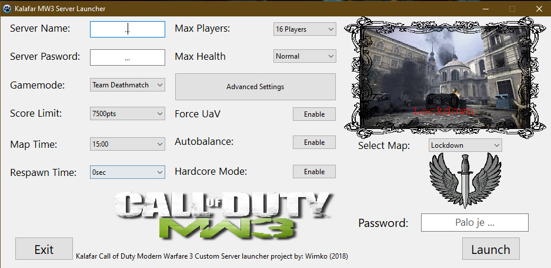

# Kalafar.com 
Kalafar (CoD MW3 Server Launcher) remake for web.

__Version__: 1.0.0 

__State__: Development

__Author__: Matej Jurík \<jurik.matejw@gmail.com\>

__Original__:

________________________________________________
## Usage
* **__Yet__ to be specified...**

## Dev Info
* **JavaScript index file**: 
    ```~/app/src/scripts/main``` 
    * Top level scripts only. Any other library functionality is written in the 'sibling'
    ```./lib/``` folder
    * Compile source JS code with ```npm run build-js``` or ```npm run build-js-watch```
    * Compiled code directory: ```~/app/static/js/main.js```
* **Sass**:
    ```~/app/src/sass/main.scss```
    * main.scss aggregates every style rule from its sub-directory ```./includes/```
    * Compile scss to css with ```npm run build-css``` or ```npm build-css-watch```
    * Static (compiled) assets can be found in ```~/app/static/css/main.css```
* **Other Assets**:
    ```~/app/static/```
    * Images
    * Views